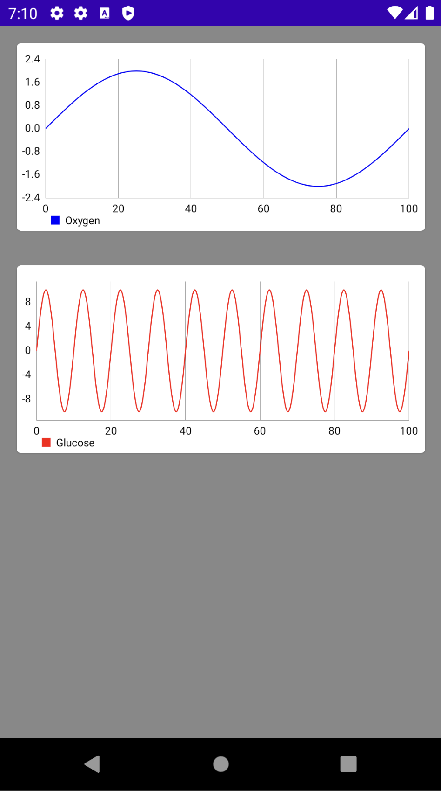

# MPAndroidChart + Compose

This is a sample project that shows how to use MPAndroidChart with Jetpack Compose.

## **Introduction**

[MPAndroidChart](https://github.com/PhilJay/MPAndroidChart) is a library for Android that allows you to create charts and graphs. It provides a wide range of customization options and supports different types of charts like line, bar, pie, scatter, and more.

Jetpack Compose is a declarative UI toolkit for Android that allows you to build user interfaces with less code and in a more efficient way.

This guide will show you how to implement *MPAndroidChart* and *Jetpack Compose* to create a line chart in your Android application. The flow of data will be as follows: Take the value in x and y from a List of data, and should follow the following order: (x,y) -> Entry -> List<Entry> -> LineDataSet -> LineData -> LineChart.

## **Prerequisites**

To follow this guide, you need to have:

- Android Studio installed on your machine
- Basic knowledge of Kotlin and Android development

## **Implementation**

### **Step 1: Add MPAndroidChart to your project**

To use MPAndroidChart in your project, you need to add it to your app's dependencies. You can do this by adding the following line to your app's `build.gradle` file:

```
implementation 'com.github.PhilJay:MPAndroidChart:v3.1.0'
```

Also don’t forget to include the repository `maven { url 'https://jitpack.io' }` in your `setting.gradle`:

```kotlin
// ...
dependencyResolutionManagement {
    repositoriesMode.set(RepositoriesMode.FAIL_ON_PROJECT_REPOS)
    repositories {
        google()
        mavenCentral()
        maven { url 'https://jitpack.io' } // this one
    }
}
// ...
```

### **Step 2: Create and setup line chart component**

Next, you need to create a component for your line chart. You can use the [AndroidView](https://developer.android.com/jetpack/compose/interop/interop-apis#views-in-compose) component to make an interoperability with the view provided by MPAndroidChart. Here is an example of a layout file for a line chart:

```
@Composable
fun LineChartComponent(modifier: Modifier = Modifier, lineData: LineData) {
    // (x,y) -> Entry -> List<Entry> -> LineDataSet -> LineData -> LineChart
    AndroidView(
        modifier = modifier,
        factory = { context ->
            LineChart(context)
                .setupLineChart()
                .apply {
                    data = lineData
                }
        },
        update = { view ->  /* Add animation here*/ }
    )
}
```

The following code is a extension function to setup the line chart using a extension function:

```
fun LineChart.setupLineChart(): LineChart = this.apply {
    setTouchEnabled(true)
    isDragEnabled = true
    setScaleEnabled(true)
    setPinchZoom(true)
    description.isEnabled = false

    // set up x-axis
    xAxis.apply {
        position = XAxis.XAxisPosition.BOTTOM
        // axisMinimum = -10f
        // axisMaximum = 10f
    }

    // set up y-axis
    axisLeft.apply {
        // axisMinimum = -5f
        // axisMaximum = 5f
        setDrawGridLines(false)
    }

    axisRight.isEnabled = false
}
```

### **Step 3: Create or get  data**

Now, you need to have the the data for your line chart. Usually the data comes from a list of objects. In this example we create a mock list of objects to represent body measures, using a data class named `MedicalData`:

```kotlin
data class MedicalData(
    val time: Long,
    val oxygen: Float,
    val glucose: Float,
    val heartRate: Float,
    val temperature: Float
)
```

```kotlin
// creating mock data (List<MedicalData>)
val mockMedicalData = (0..100).map {
    MedicalData(
        time = startTimestamp + (it * 60),
        oxygen = 2 * sin((it * 2 * PI * 0.01).toFloat()),
        glucose = 10 * sin((it * 2 * PI * 0.1).toFloat()),
        heartRate = sin((it * 2 * PI * 20).toFloat()),
        temperature = sin((it * 2 * PI * 15).toFloat())
    )
}

// List<MedicalData> -> List<Float> (ListOxygenData)
val listOxygenData = mockMedicalData.map { it.oxygen }
```

### **Step 4: Process data for the LineChart**

Now, you need to process the data before added it to your line chart. After you know what are your x and y values for your chart, you should convert each value to Entry, creating a list of `List<Entry>`, then added it to `LineDataSet` and set it to a `LineData`, and finally pass it to the `LineChart`. Here is an example of how to use the mock values created in the last step to process them for the `LineChart`:

```kotlin
// List<Float> -> List<Entry> -> LineDataSet
val oxygenDataSet = listOxygenData.createDataSetWithColor(
    datasetColor = android.graphics.Color.BLUE,
    label = "Oxygen"
)
```

The following is the extension function created to get the LineData set in for the above code:

```kotlin
// List<Float> -> List<Entry> -> LineDataSet
fun List<Float>.createDataSetWithColor(
    datasetColor: Int = android.graphics.Color.GREEN,
    label: String = "No Label"
): LineDataSet {
    // List<Float> -> List<Entry>
    val entries = this.mapIndexed { index, value ->
        Entry(index.toFloat(), value)
    }
    // List<Entry> -> LineDataSet
    return LineDataSet(entries, label).apply {
        color = datasetColor
        setDrawFilled(false)
        setDrawCircles(false)
        mode = LineDataSet.Mode.CUBIC_BEZIER
    }
}
```

### **Step 4: pass the data to the chart component**

Finally, you can implement your line chart with the `LineChartComponent` composable function created above.

```kotlin
@Composable
fun LineChartCard(modifier: Modifier = Modifier, lineData: LineData) {
    Card(
        modifier = modifier
            .fillMaxWidth()
            .aspectRatio(2f) // (width:height) 2:1
            .padding(16.dp)
    ) {
        LineChartComponent(
            modifier = Modifier.fillMaxSize(),
            lineData = lineData
        )
    }
}
```

You can then call this composable function in your activity or fragment inside of `setContent` like this:

```kotlin
val lineDataOxygen = LineData(oxygenDataSet)
setContent {
	Column(
	    Modifier
	        .fillMaxSize()
	        .background(color = Color.Gray)
	) {
	    LineChartCard(lineData = lineDataOxygen)
	}
}
```




#Autor
Alejandro Daniel José Gómez Flórez (aldajo92).